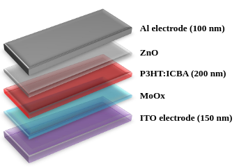
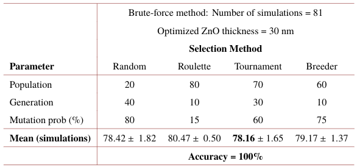
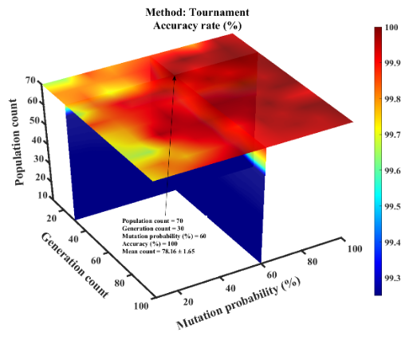
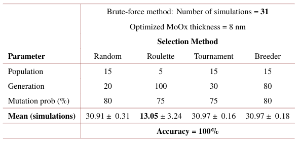
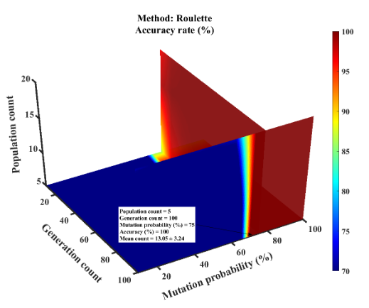
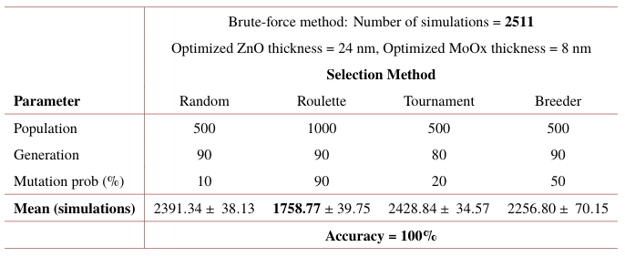
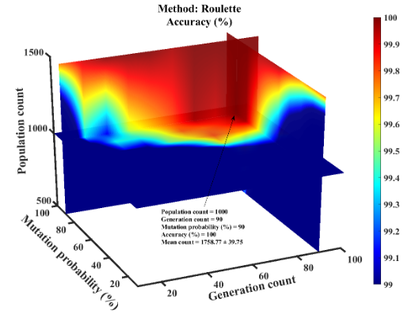

## About
**Genetic Algorithm** for efficient single and multi-layer **solar cell** thickness optimization

## Contents
[Dependencies](#dependencies) • [Solar Cell](#solar-cell-device-structure) • [How to Use](#how-to-use) • [Results](#results) • [Cite](#acknowledgement)

## Dependencies
* Tested on Windows 7 and Ubuntu 18.04
* Test on Matlab 2018b and 2019a
* Toolboxes:
    * Add-Ons > Get Add-Ons
    * *de2bi* and *bi2de* functions:
        * Communication System Toolbox (Matlab 2018b)
        * Communications Toolbox (Matlab 2019a)
    * Parallel Computing Toolbox
    * Trading Toolbox
* `cprintf.m` ([download link](https://www.mathworks.com/matlabcentral/fileexchange/24093-cprintf-display-formatted-colored-text-in-the-command-window))

## Solar cell device structure
Evolutionary algorithm in ZnO and MoOx Optical Spacer
  

  
  

## How to Use
1. Run code:
    * Single layer: `./[MoOx or ZnO folder]/[MoOx or ZnO]_Main_frontend_gui.m`
    * Multiple layer: `./[ZnO+MoOx folder]/[ZnO_and_MoOx]_Main_frontend_gui.m`
2. Choose how many runs of each selection to perform

## Results
> Saved in Excel files, with number of sheets equivalent to the number of runs in each selection.

> Accuracy of 100%: all the 5000 runs converged to the optimal solution.

#### ZnO single layer optimization [[excel](./ZnO%20optical%20spacer%20optimization%20files/RESULTS)]
  

    
    
  

#### MoOx single layer optimization [[excel](./MoOx%20optical%20spacer%20optimization%20files/RESULTS)]
  

    
    
  

#### ZnO+MoOx multi-layer optimization [[excel](./ZnO+MoOx%20optical%20spacer%20optimization%20files/RESULTS)]
  

    
    
  

## Acknowledgement
Co-First Authors: [Premkumar Vincent](https://github.com/vinpremkumar) and [Gwenaelle Cunha Sergio](https://github.com/gcunhase) had equal contribution

Include citation once available
